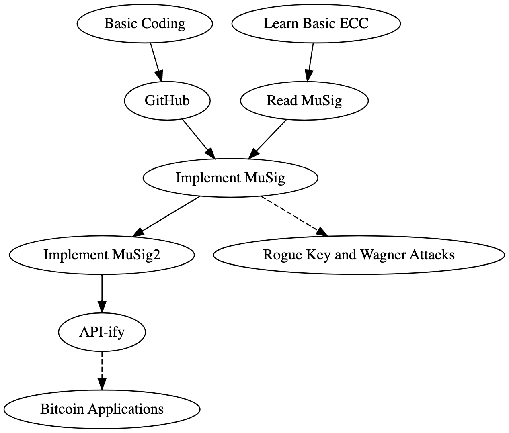

# IU Math Grad Student Coding & Crypto Crash Course

Using this repository, we will be learning the basics of software engineering and cryptography for the sake of learning new skills, building resumes, and for some, preparing to apply for summer internships in industry.

This crash course will take place asyncronously over the Spring semester online, mostly here in this repository. There is also an accompanying slack channel for questions and discussions.

### Goals

* Learn to code in at least two languages
* Learn to Software Engineer
  * Collaborative, industry-like FOSS project workflow
* Learn enough Cryptography to be dangerous
* Implement [MuSig2](https://eprint.iacr.org/2020/1261.pdf)
* Document everything

Generally speaking these goals will be reached by asynchronously proceeding in the following stages:

### Getting Started

The first two concurrent stages of this course (as seen above) are to learn basic coding and to learn basic Elliptic Curve Cryptography (ECC). Make sure to write down notes of the important things you've learned as we will be collectively generating documents/resources to make this course easier for future years, as well as for our own use. This includes notes about individual programming languages, software engineering in general, and cryptographic concepts. Please also take notes about feedback for how this course may be run more effectively in the future, including changes that should be made to this or other teaching documents, which should be proposed as an issue or a pull request (more on what these are below).

#### Starting to Code (to be done concurrently with learning ECC)

We will learn basic coding through a [series of exercises](exercises.md) that I have collected. These exercises begin with simple tasks whose primary purpose is to get you familiar with the basic structure and syntax of programs in a few different programming languages. You can decide for yourself which problems seem interesting and even propose your own exercises.

In the beginning it will suffice to attempt solutions to these exercises within [online code editors](#online-editors) (make sure to save your code on your computer though), and you can get started right away without any installation! But it will quickly become benificial to [install an Integrated Development Environment (IDE)](#installation) and write code locally on your own computer. Solutions will then be posted here, on this GitHub repository, as pull requests which your peers and I (and some other developers on occasion) will review and give feedback (for correctness as well as clarity and style/design). Note that you are allowed and encouraged to seek help on all of these exercises both from other people and the internet. If you have not yet installed git on your computer, you can submit solutions directly to me and I will push them onto this repository for review for you.

You are also encouraged (when it makes sense) to look at, and even improve upon, other's solutions and see how fast and/or how simply/clearly you can solve each problem you attempt. One of the goals here is to learn multiple programming languages so, for example, if you are attempting a problem with the intention primarily of getting the hang of a new language, it is completly alright to simply transpose a solution from another language.

As you are becoming more comfortable with writing code in multiple programming languages, I will also begin to assign [tutorials](#tutorials) on [using Git and GitHub](#git-and-github), as well as other things such as more interesting kinds of tests that we can write.

#### Learning ECC (to be done concurrently with starting to code)

I have compiled [a succinct list](#cryptography-resources) of relatively easy readings introducing the relevant ideas in cryptography, and in particular Elliptic Curve Schnorr digital signatures. I expect that these readings alone, along with some [accompanying exercises](exercises.md), will be sufficient to learn enough cryptography to acheive our goals, though further exploration is of course allowed/encouraged.

I recommend you begin with the [Discrete Log Problem](DLOGExcerpt.pdf) and then the [Elliptic Curve](EllipticCurveExcerpt.pdf) excerpts, and then move on to my blog posts about [Schnorr signatures](https://suredbits.com/introduction-to-schnorr-signatures/) and then the [MuSig protocol](https://suredbits.com/schnorr-applications-musig/). Finally, you will be ready to read the actual [MuSig Paper](https://eprint.iacr.org/2018/068.pdf) followed by the [MuSig2 Paper](https://eprint.iacr.org/2020/1261.pdf) which improves upon it, though I do not expect or encourage any of you to read the actual proofs in these papers, only the actual constructions (which constitute only the first few pages of each paper). If you are interested in the details of why MuSig2 needs to avoid hash-sum collisions, I will also encourage you to read [Wagner Generalized Birthday Problem Paper](https://www.iacr.org/archive/crypto2002/24420288/24420288.pdf), which is also a fun read for its own sake.

None of these readings should be prohibitively hard, if something is it is probably not something you need to be reading (e.g. we won't be reading all of the MuSig or MuSig2 papers, only the construction parts), if you're unsure then ask!

This reading list should suffice for our purposes, but I have also included some [extra readings below](#cryptography-resources) if you are interested in learning more, and there is much more out there and you should feel free to ask me for further resources if you have any specific (or vague) interests you would like to pursue.

#### Git and GitHub

To begin using GitHub, I recommend you begin with this [set up Git](https://docs.github.com/en/get-started/quickstart/set-up-git) tutorial to help with installation and configuration, and then this [fork a repo](https://docs.github.com/en/get-started/quickstart/fork-a-repo) tutorial where you should attempt to fork this repository instead of the one provided; this will allow you to make changes on your fork and propose them as pull requests to this repository (also see [below](#tutorials) for corrections to some tutorials).

Once you have done that basic installation and configuration, I recommend following [this tutorial](https://product.hubspot.com/blog/git-and-github-tutorial-for-beginners) which will walk you through the most common commands and workflow of using Git.

#### Next Steps

Once enough people have reached the point that they feel comfortable with basic coding, using GitHub collaboratively, and ECC (circa late Febuary - early March), we will open some design discussions on this repository and begin our first project of implementing [MuSig](https://eprint.iacr.org/2018/068.pdf)! We will implement this protocol in multiple languages and generate documentation about this protocol. After we iterate a few times to turn our working (and tested) implementations into final products, we will then implement the [MuSig2](https://eprint.iacr.org/2020/1261.pdf) protocol by building off of our first project. More to come after this if there is time.

## Resource Table of Contents

* [Cryptography Resources](#cryptography-resources)
* [Online Editors](#online-editors)
* [Tutorials](#tutorials)
* [Cheat Sheets](#cheat-sheets)
* [Installation](#installation)
* [Style Guides](#style-guides)
* [Linters](#linters)

## Cryptography Resources

* [Introduction to Mathematical Cryptography](https://link.springer.com/book/10.1007/978-0-387-77993-5) Excerpts
  * [Discrete Log Problem](DLOGExcerpt.pdf)
  * [Elliptic Curve](EllipticCurveExcerpt.pdf)
* [Suredbits Schnorr Blog Series](https://suredbits.com/schnorr-series-summary/)
  * [Intro to Schnorr Signatures](https://suredbits.com/introduction-to-schnorr-signatures/)
  * [MuSig](https://suredbits.com/schnorr-applications-musig/)
  * Extra
    * [Security Proof Sketch](https://suredbits.com/schnorr-security-part-1-schnorr-id-protocol/)
    * [Adaptor Signatures](https://suredbits.com/schnorr-applications-scriptless-scripts/)
    * [Batch Verification](https://suredbits.com/schnorr-applications-batch-verification/)
    * [FROST](https://suredbits.com/schnorr-applications-frost/)
* [MuSig Paper](https://eprint.iacr.org/2018/068.pdf)
* [Wagner Generalized Birthday Problem Paper](https://www.iacr.org/archive/crypto2002/24420288/24420288.pdf)
* [MuSig2 Blog Post](https://popeller.io/schnorr-musig2)
* [MuSig2 Paper](https://eprint.iacr.org/2020/1261.pdf)
* [t-bast cheat sheat](https://github.com/t-bast/lightning-docs/blob/master/schnorr.md)
* Extra
  * [FROST Paper](https://eprint.iacr.org/2020/852.pdf)
  * [MuSig-DN Paper](https://eprint.iacr.org/2020/1057.pdf)
  * [Graduate Course in Applied Cryptography](https://toc.cryptobook.us/book.pdf)

## Online Editors

* [Scala](https://scastie.scala-lang.org/)
* [C#](https://dotnetfiddle.net/)
* [Go](https://go.dev/play/)
* [Python](https://www.online-python.com/)
* [Typescript](https://www.typescriptlang.org/play)
* [Haskell](https://replit.com/languages/haskell)
* [Julia](https://julialang.org/learning/tryjulia/)

## Tutorials

* [Linux Terminal](https://ubuntu.com/tutorials/command-line-for-beginners)
* [Getting Started with Git and GitHub](https://product.hubspot.com/blog/git-and-github-tutorial-for-beginners)
  * If creating a new repository (not forking this one) then to the start of step 6 where one uses "git checkout master" also run "git branch -M main" before proceeding (this changes our branch to "main" instead of "master")
  * Edit a file in your branch before pushing in step 7 (as it stands the tutorial does not show what happens when a change is actually made)
  * If you forked a different repository, for step 10, instead of using "git pull origin master" run "git pull origin main" (since earlier we changed our branch to "main")
* [Git](https://docs.github.com/en/get-started/quickstart)
* [GitHub Gists](https://docs.github.com/en/github/writing-on-github/editing-and-sharing-content-with-gists/creating-gists)
* [Go](https://go.dev/tour/welcome/1)
* [C#](https://dotnet.microsoft.com/learn/dotnet/hello-world-tutorial/intro)
* [Scala](https://docs.scala-lang.org/tutorials.html)
* [Haskell](http://learnyouahaskell.com/introduction)
* [Julia](https://julialang.org/learning/)

## Cheat Sheets

* [Markdown](https://github.com/adam-p/markdown-here/wiki/Markdown-Cheatsheet)
* [Git](https://education.github.com/git-cheat-sheet-education.pdf)
* [Linux Terminal](https://www.fosslinux.com/45587/linux-command-cheat-sheet.htm)
* [Mac Terminal](https://github.com/0nn0/terminal-mac-cheatsheet)
* [Scala](https://docs.scala-lang.org/cheatsheets/index.html)
* [C#](https://github.com/jwill9999/C-Sharp-Cheatsheet)
* [Python](https://www.pythoncheatsheet.org/)
* [Typescript](https://www.sitepen.com/blog/typescript-cheat-sheet)
* [Go](https://devhints.io/go)
* [Haskell](https://jutge.org/doc/haskell-cheat-sheet.pdf)

## Installation

* [Git for Windows](https://gitforwindows.org/)
* [Homebrew for Mac](https://brew.sh/)
* [VirtualBox VM](https://www.virtualbox.org/)
* [Scala](https://www.scala-sbt.org/1.x/docs/Setup.html)
  * [This first for mac/linux](https://sdkman.io/install)

* [Visual Studio](https://code.visualstudio.com/)
* [IntelliJ](https://www.jetbrains.com/idea/)
* [PyCharm](https://www.jetbrains.com/pycharm/)
* [C#](https://dotnet.microsoft.com/download)
* [Python](https://wiki.python.org/moin/BeginnersGuide/Download)
* [Typora](https://typora.io/)
* [Go](https://go.dev/)
* [Typescript](https://www.typescriptlang.org/download)
* [Haskell](https://www.haskell.org/platform/)

## Style Guides

* [Scala](https://docs.scala-lang.org/style/)
* [C#](https://docs.microsoft.com/en-us/dotnet/csharp/fundamentals/coding-style/coding-conventions)
* [Python](https://www.python.org/dev/peps/pep-0008/)
* [Typescript](https://google.github.io/styleguide/tsguide.html)
* [Google Style Guides](https://google.github.io/styleguide/)
* [Go](https://github.com/uber-go/guide/blob/master/style.md)
* [Haskell](https://wiki.haskell.org/Programming_guidelines#Good_Programming_Practice)

## Linters

* [Scalafmt](https://scalameta.org/scalafmt/)
* [Pylint](https://pylint.pycqa.org/en/latest/)
* [Typescript](https://palantir.github.io/tslint/)
* [Go](https://pkg.go.dev/cmd/gofmt)
* [C#](https://google.github.io/styleguide/csharp-style.html)
* [Haskell](https://hackage.haskell.org/package/hlint)
